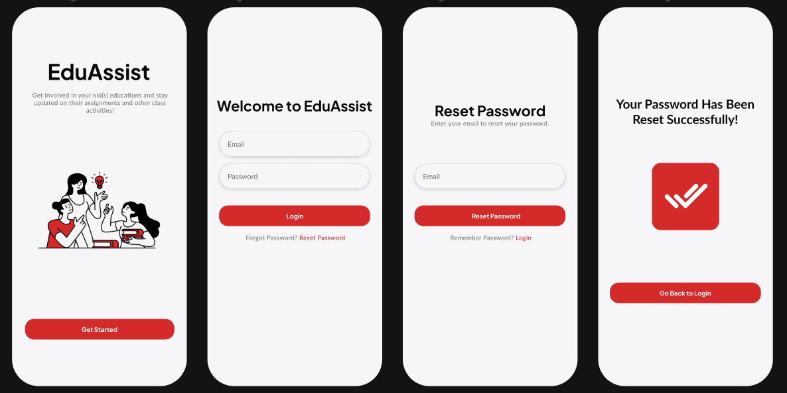
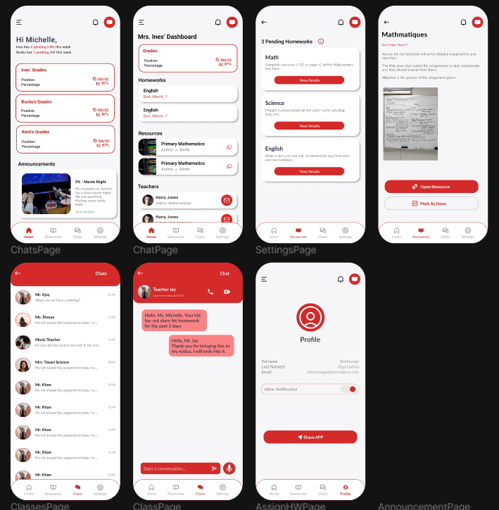
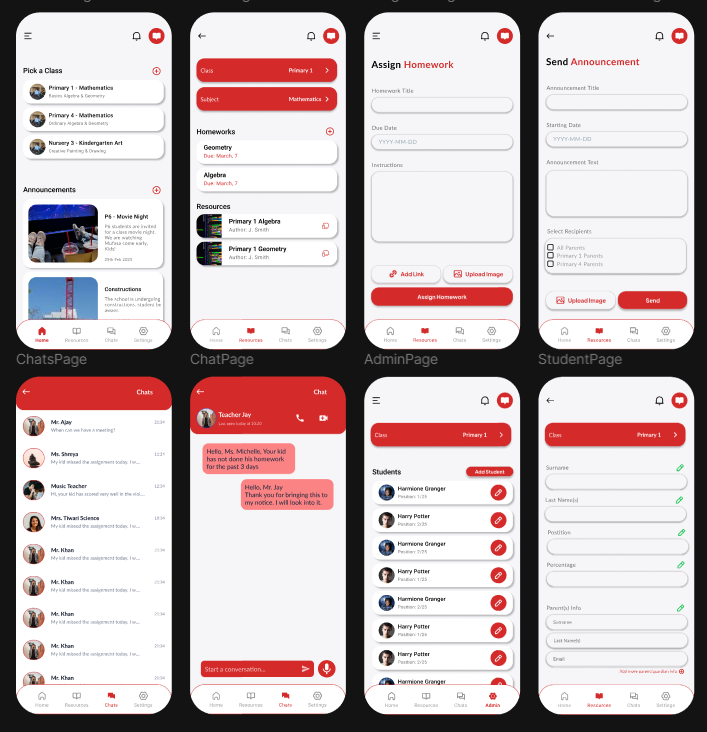

# EduAssist: Parent-Teacher Communication & Learning Support App

## Description
EduAssist is a mobile application designed to keep parents actively involved in their children's education. The app provides visibility into kids' assignments and features a recommendation system that suggests REB (Rwanda Education Board) e-learning resources based on assignment descriptions. Parents can access relevant learning materials by clicking on recommended links within the app. 

### Key Features
- **Assignment Tracking**: Parents can view their children's assignments.
- **AI-Powered Recommendation System**: Suggests relevant REB e-learning resources based on assignment descriptions.
- **Teacher-Parent Communication**: Enables direct messaging between parents and teachers.
- **Announcements**: Provides updates and important notices from schools.
- **Grades & Reports**: Parents can track their child's academic performance.
- **Past Resources Archive**: Access to past assignments and resources for review.

## Setup and Installation

### Prerequisites
Ensure you have the following installed:
- Python 3.x
- pip
- Virtual environment (optional but recommended)

### Step 1: Clone the Repository
```bash
git clone https://github.com/ZigaLarissa/EduAssist
cd EduAssist
```

### Step 2: Create a Virtual Environment (Optional)
```bash
python -m venv venv
source venv/bin/activate  # On Mac
venv\Scripts\activate     # On Windows
```

### Step 3: Install Dependencies
```bash
pip install -r requirements.txt
```

### Step 4: Run the Mobile App
Navigate to the mobile app directory and run:
```bash
cd frontend
cd eduassist
npm run android
```

### Step 5: Test the Recommendation System API
Open and run the Jupyter Notebook to test the recommendation system.
```bash
cd ..
cd ..
cd model
python app.py
```

Or ChecK the already cloud-hosted API: [Deployed Container](https://rcrs-image-104267375198.us-central1.run.app/docs)

## Download the App APK
Get the latest APK through;
[EduAssist Android Application APK](https://drive.google.com/file/d/1mxMXjP6gvl86MELf9VsYk1tqc-V9FfFO/view?usp=sharing)

## Product Demonstration
[Watch the application 5 minutes demonstration](https://www.loom.com/share/cba2565100a445c49c7ab5c326f01d36?sid=2f1ba35b-0107-4a2e-9b35-f7d3d7245ed1)

## Designs
The design elements for this project include:

#### Figma Mockups: 

#### Login Screens


#### Parent App Screens


#### Teacher App Screens



[View Figma Designs](https://www.figma.com/design/uViFFozXs86d6exWbJa9h5/EduAssist?node-id=42-18814&t=C1dwlhU5RPK0E38c-1)

## Deployment Plan
The deployment of EduAssist follows these steps:
1. **Mobile App Development**
   - Build and test the Flutter-based mobile application.
   - Implement UI/UX enhancements based on user feedback.
2. **Model Training & Evaluation**
   - Train the recommendation model using TF-IDF and cosine similarity.
   - Evaluate model performance using accuracy, precision, and recall.
3. **Backend Deployment**
   - Deploy the recommendation system as a FastAPI service.
   - Host it on a cloud platform like AWS, GCP, or Heroku.
4. **Frontend Integration**
   - Connect the API with the mobile application.
   - Ensure smooth communication between UI and backend.
5. **Testing & Optimization**
   - Perform user testing.
   - Optimize model performance based on feedback.
6. **Production Release**
   - Deploy the system for public use.
   - Monitor and improve continuously.

## Initial software product/solution demonstration

[View Demo Video](https://drive.google.com/file/d/1dklFcMEPbwWeEf0dYE4nII3zdAj5Yn9f/view?usp=sharing)


## Contributors
- Larissa Bizimungu

## License
This project is licensed under [MIT License](LICENSE).

